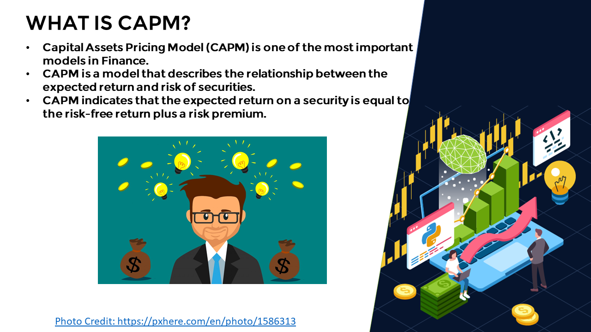
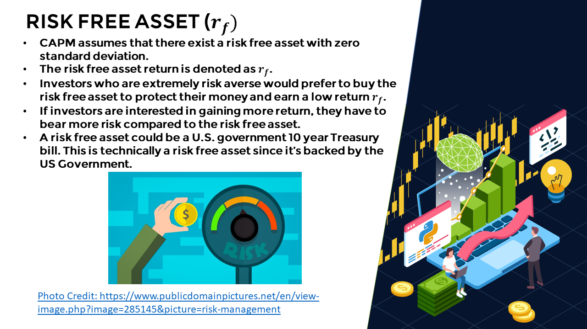
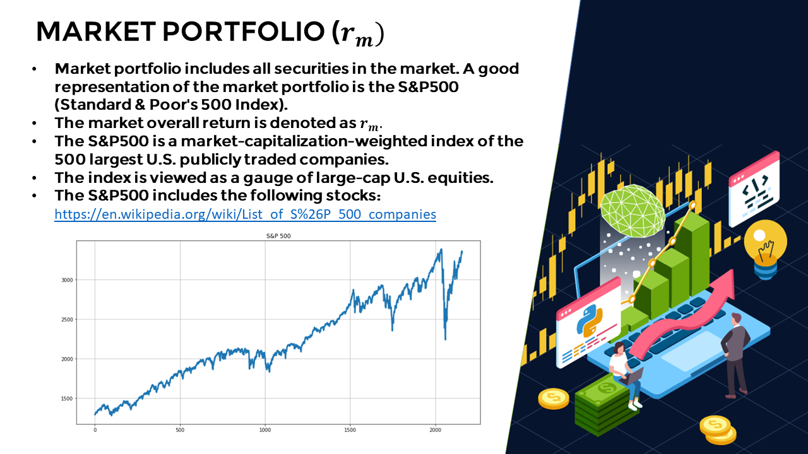
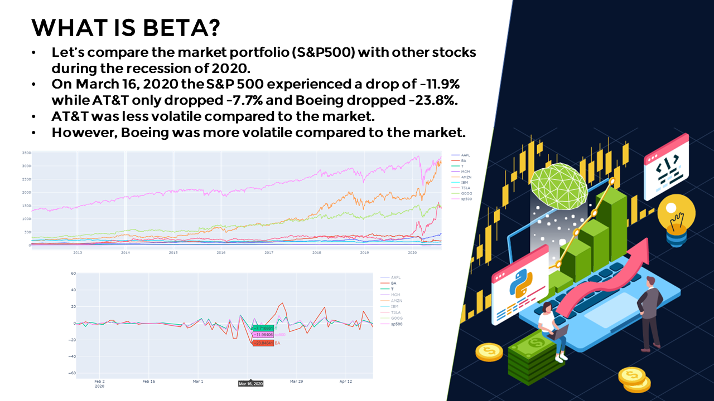
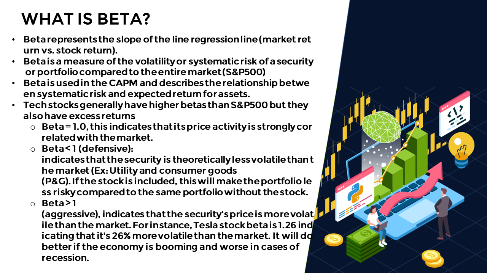
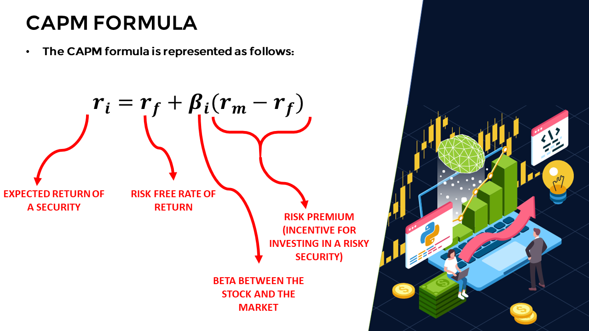
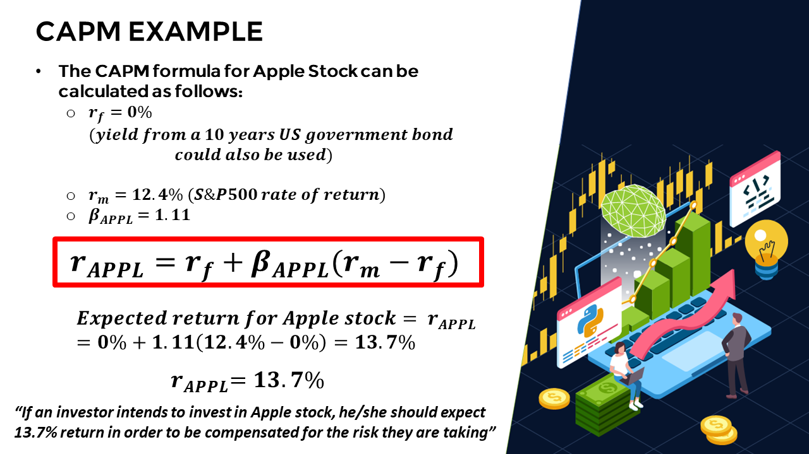

# Experimenting-with-CAPM

This project and the images below come from the Udemy Python and Machine Learning for Financial Analysis Course. 

GOAL: Compare stock performance over time by using the Capital Asset Pricing Model.
CAPM describes the relationship between expected return and risk.
We'll also compare the results of different allocation amounts among the chosen stocks in the portfolio.

This is just one of many ways to analyse securities and was an interesting project. Risk free rate of return, the return of the stock market, and the beta of the stock are all factors that influence the expected rate of return for a security. 

